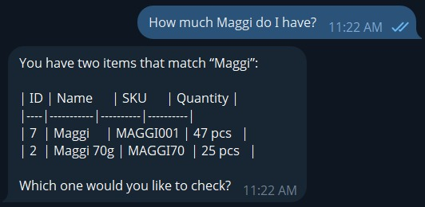
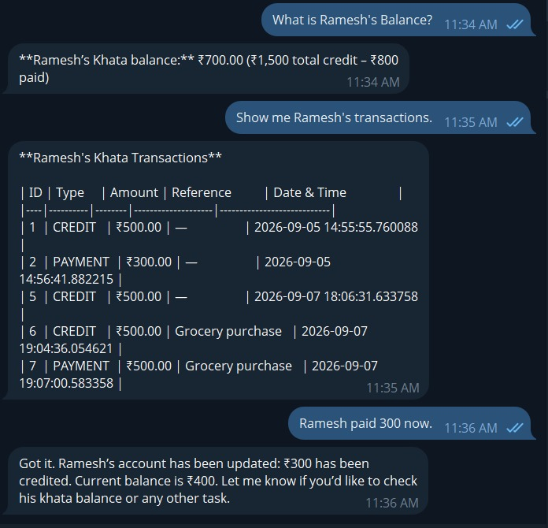
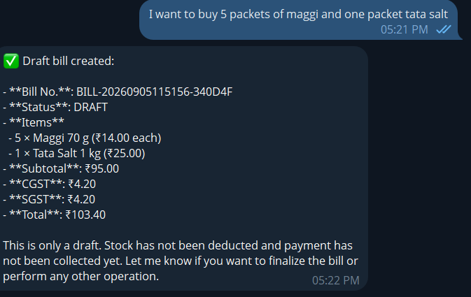
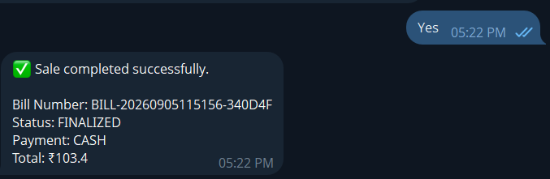
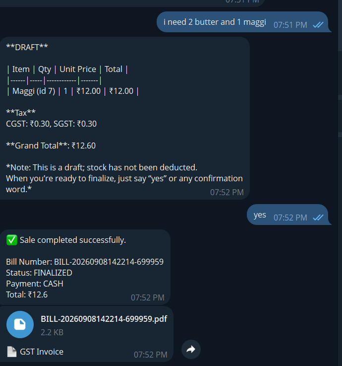
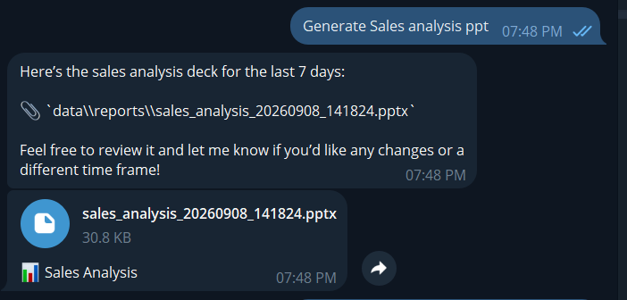

# 📸 KiranaPilot — Demo Results

All demonstrations below were performed through the **Telegram interface**.

---

## 1. Inventory & Stock

**Stock lookup:** Checked the current quantity of a product through Telegram.

**Low-stock check:** Identified the product with the lowest available stock.

**Receive stock:** Added incoming stock and verified the updated quantity.

**Inventory count and listing:** Returned the number of products currently registered and displayed the product catalog.

---

## 2. Khata

**Customer balance & transactions:** Checked Ramesh's balance, transaction history, and recorded a payment.

---

## 3. Billing

**Draft bill:** Created a bill for multiple products.

**Sale confirmation:** Confirmed the draft bill and completed the sale.

**Invoice generation:** Automatically generated and sent the GST invoice PDF after sale confirmation.

---

## 4. Sales Analysis

**Sales analysis:** Generated the sales analysis PowerPoint on request.

---

## Verified Features

- ✅ Product search
- ✅ Stock lookup
- ✅ Low-stock detection
- ✅ Receive stock
- ✅ Inventory listing
- ✅ Product count
- ✅ Draft billing
- ✅ Sale confirmation & finalization
- ✅ Automatic GST invoice PDF
- ✅ Sales analysis PPT
- ✅ Khata balance
- ✅ Khata transactions
- ✅ Khata payment/settlement
- ✅ Telegram-based interaction