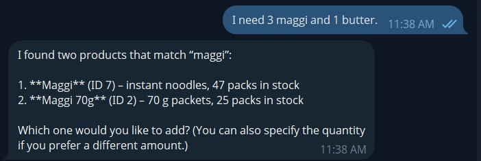

# 📸 KiranaPilot — Demo Results

The following screenshots demonstrate the implemented Telegram-based supermarket operations workflows.

---

## 1. Inventory Stock Lookup

**Query:** How much Maggi do I have?

The agent identifies matching products and displays their current stock.

---

## 2. Low Stock Detection

**Query:** Which product is least on stock?

The agent identifies the product with the lowest available stock.

---

## 3. Stock Receiving & Verification

**Action:** Received 5 packets of Amul Butter 100g.

The inventory is updated and the new stock quantity is verified through Telegram.

---

## 4. Inventory Product Count

**Query:** How many products do I have?

The agent returns the total number of registered products.

---

## 5. Khata Management

**Actions:** Check customer balance, view transactions, and record payment.

The agent retrieves and updates customer Khata information.

---

## 6. Draft Billing & Sale Confirmation

**Action:** Create a bill for 5 Maggi and 1 Tata Salt, then confirm the sale.

The system creates a draft first and finalizes the sale only after confirmation.

