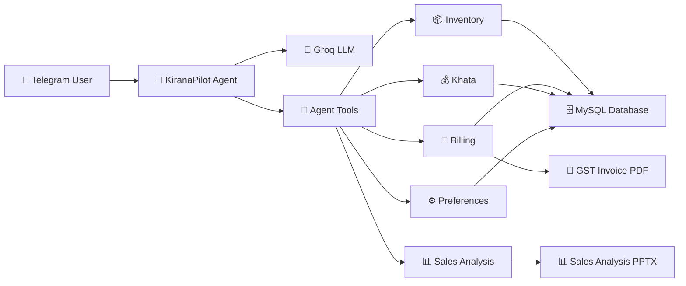
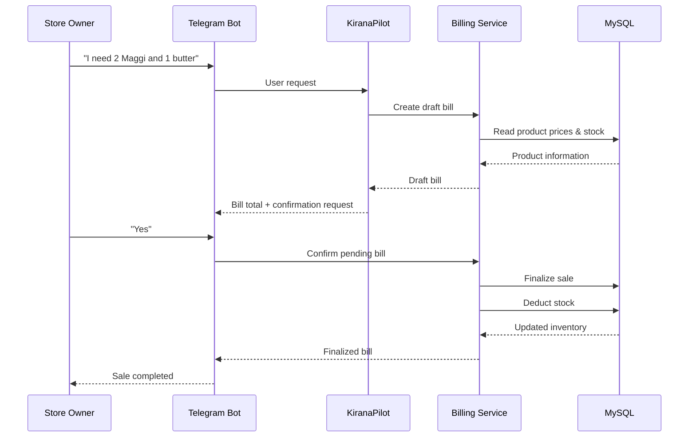
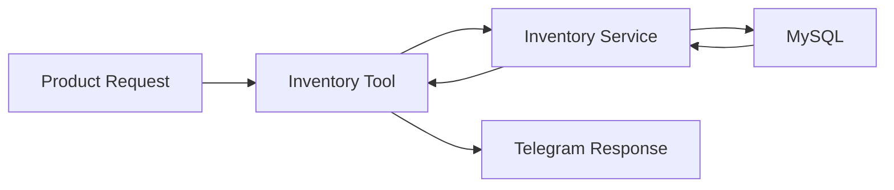
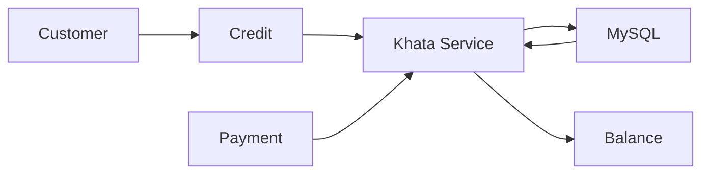

# 🛒 KiranaPilot — AI-Powered Supermarket Operations Agent

An AI-powered operations assistant for small retail stores that helps manage inventory, stock, billing, customer credit, and sales insights through a conversational Telegram interface.

**Stack:** Python · FastAPI · SQLAlchemy · MySQL · Telegram Bot · Groq LLM · OpenAI Agents SDK

---

## System Architecture



---

## Features

### 📦 Inventory Management

* Add new products
* Search products by name
* View individual product details
* View complete inventory
* Check current stock
* Detect low-stock products
* Receive additional stock
* Track reorder levels
* Count products
* Calculate total inventory quantity

### 🧾 Billing

* Create draft bills conversationally
* Add multiple products to a bill
* Calculate subtotal, CGST, SGST and total
* Edit draft bills
* Review pending bills
* Confirm sales
* Cancel pending bills
* Deduct stock only after sale confirmation
* Record payment mode
* Generate GST invoice PDFs for finalized bills

### 💰 Khata / Customer Credit

* Add customer credit
* Record customer payments
* View outstanding balance
* View customer transaction history
* Track total credit and payments

### 📊 Sales Analysis

* View daily sales summary
* Track finalized bill count
* Calculate total sales
* Calculate CGST and SGST
* Generate sales analysis PowerPoint reports
* Analyze sales over a configurable number of days

### 🤖 Telegram Assistant

KiranaPilot provides a conversational interface for store operations.

Example requests:

```text
How much Maggi do I have?

Which products are low on stock?

I need 2 Maggi and 1 butter, create a bill

Yes, finalize bill

Show Ramesh's balance

How much did I sell today?
```

The agent identifies the required operation and invokes the appropriate backend tool.

---

## Billing Confirmation Flow



### Important Billing Rule

A bill is initially created as a **DRAFT**.

Stock is **not deducted** when the draft is created.

Stock is deducted only after the owner explicitly confirms the sale.

This prevents accidental inventory deductions from abandoned or cancelled bills.

---

## Inventory Flow



Example:

```text
Owner:
How much Maggi do I have?

KiranaPilot:
I found two products that match "Maggi":

ID  Name          Quantity
7   Maggi         47
2   Maggi 70g     25

Which one did you want to know?
```

The agent handles ambiguous product names instead of assuming a product automatically.

---

## Khata Flow



Example balance:

```text
Customer: Ramesh

Total Credit: ₹1500
Total Paid:   ₹800
Balance:      ₹700
```

Transaction history records both credit and payment entries.

---

## Sales & Reporting

The system supports:

```text
Finalized Bills
      ↓
Daily Sales Summary
      ↓
Sales Metrics
      ↓
PowerPoint Analysis Report
```

Generated sales information includes:

* Total sales
* Number of finalized bills
* Average bill value
* Daily sales information
* CGST
* SGST

GST invoice PDFs can also be generated for finalized bills.

---

## Owner Preferences

Store owners can save operational preferences that can be reused by the agent.

Example:

```text
Owner:
Remember that I prefer cash payments.

KiranaPilot:
Preference saved.
```

Preferences are stored in the database rather than only in the current Telegram session.

---

## REST API

The FastAPI backend exposes endpoints for the core supermarket operations.

The API can be tested independently using tools such as Postman.

Example health check:

```http
GET /health
```

Example inventory request:

```http
GET /debug/products
```

The backend is separated from the Telegram interface, allowing the business logic to be used independently of the conversational layer.

---

## Project Structure

```text
kirana-pilot/
│
├── app/
│   │
│   ├── agent/
│   │   ├── agent.py
│   │   ├── instructions.py
│   │   └── tools.py
│   │
│   ├── domain/
│   │   ├── inventory/
│   │   ├── billing/
│   │   ├── khata/
│   │   └── preferences/
│   │
│   ├── infrastructure/
│   │   ├── database/
│   │   └── llm/
│   │
│   ├── interfaces/
│   │   └── telegram/
│   │
│   ├── documents/
│   │   ├── invoice.py
│   │   └── analysis_deck.py
│   │
│   └── main.py
│
├── tests/
│
├── .env
├── requirements.txt
├── DEMO_RESULTS.md
└── README.md
```

---

## Core Agent Tools

| Area               | Tools                                                             |
| ------------------ | ----------------------------------------------------------------- |
| Inventory          | Search, get product, stock, low-stock, add product, receive stock |
| Inventory Overview | Product count, list inventory, total quantity                     |
| Billing            | Create draft, edit draft, get pending bill, confirm sale          |
| Khata              | Add credit, settle credit, balance, transactions                  |
| Documents          | GST invoice, sales analysis deck                                  |
| Analytics          | Daily sales summary                                               |
| Preferences        | Set and retrieve owner preferences                                |

---

## Technology Stack

| Layer      | Technology            |
| ---------- | --------------------- |
| Language   | Python                |
| API        | FastAPI               |
| Database   | MySQL                 |
| ORM        | SQLAlchemy            |
| AI Agent   | OpenAI Agents SDK     |
| LLM        | Groq                  |
| Interface  | Telegram Bot          |
| Validation | Pydantic              |
| Invoice    | PDF generation        |
| Reporting  | PowerPoint generation |

---

## Running the Project

### 1. Create virtual environment

```bash
python -m venv .venv
```

### 2. Activate environment

Windows PowerShell:

```bash
.venv\Scripts\Activate.ps1
```

### 3. Install dependencies

```bash
pip install -r requirements.txt
```

### 4. Configure environment variables

Create a `.env` file containing the required database, Telegram and LLM configuration.

### 5. Start the FastAPI backend

```bash
uvicorn app.main:app --reload
```

Backend:

```text
http://127.0.0.1:8000
```

### 6. Start Telegram Bot

```bash
python -m app.interfaces.telegram.bot
```

The bot should display:

```text
============================================================
KiranaPilot Telegram Bot
Bot is running...
============================================================
```

---

## Demo Evidence

The repository includes [`DEMO_RESULTS.md`](DEMO_RESULTS.md), containing representative outputs from the implemented features and API/Telegram testing.

The document demonstrates:

* Inventory search
* Stock checking
* Low-stock detection
* Stock receiving
* Product listing
* Draft billing
* Bill editing
* Bill confirmation
* Stock deduction
* Khata credit
* Khata payment
* Customer balance
* Transaction history
* Daily sales information
* Generated documents

---

## Project Status

**Status: Functional Prototype**

Implemented core supermarket operations with a conversational Telegram interface and backend services for inventory, billing, customer credit, preferences, and sales analysis.
